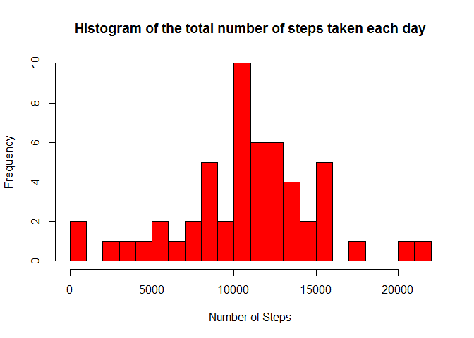
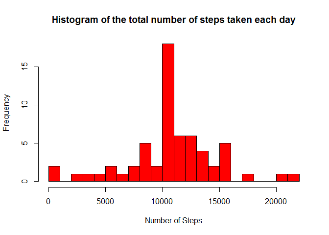
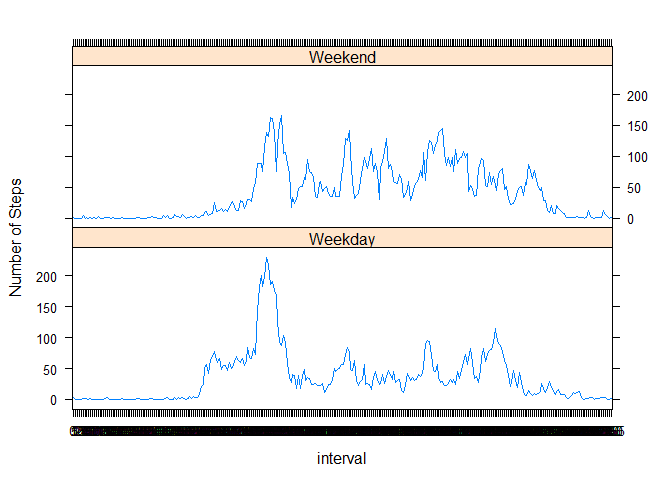

# Reproducible Research: Peer Assessment 1


##Introduction

It is now possible to collect a large amount of data about personal movement using activity monitoring devices such as a Fitbit, Nike Fuelband, or Jawbone Up. These type of devices are part of the "quantified self" movement - a group of enthusiasts who take measurements about themselves regularly to improve their health, to find patterns in their behavior, or because they are tech geeks. But these data remain under-utilized both because the raw data are hard to obtain and there is a lack of statistical methods and software for processing and interpreting the data.

This project makes use of data from a personal activity monitoring device. This device collects data at 5 minute intervals through out the day. The data consists of two months of data from an anonymous individual collected during the months of October and November, 2012 and include the number of steps taken in 5 minute intervals each day. The goal of this project is to write a report that answers the questions detailed below.

## Loading and preprocessing the data
1. First we have to read the data from the "activity.csv".


```r
data <- read.csv("activity.csv", header = TRUE, sep = ",", na.strings = "NA")
```

2. Checking the summary and other useful observations for the dataset.


```r
summary(data)
```

```
##      steps                date          interval     
##  Min.   :  0.00   2012-10-01:  288   Min.   :   0.0  
##  1st Qu.:  0.00   2012-10-02:  288   1st Qu.: 588.8  
##  Median :  0.00   2012-10-03:  288   Median :1177.5  
##  Mean   : 37.38   2012-10-04:  288   Mean   :1177.5  
##  3rd Qu.: 12.00   2012-10-05:  288   3rd Qu.:1766.2  
##  Max.   :806.00   2012-10-06:  288   Max.   :2355.0  
##  NA's   :2304     (Other)   :15840
```


```r
str(data)
```

```
## 'data.frame':	17568 obs. of  3 variables:
##  $ steps   : int  NA NA NA NA NA NA NA NA NA NA ...
##  $ date    : Factor w/ 61 levels "2012-10-01","2012-10-02",..: 1 1 1 1 1 1 1 1 1 1 ...
##  $ interval: int  0 5 10 15 20 25 30 35 40 45 ...
```


```r
head(data)
```

```
##   steps       date interval
## 1    NA 2012-10-01        0
## 2    NA 2012-10-01        5
## 3    NA 2012-10-01       10
## 4    NA 2012-10-01       15
## 5    NA 2012-10-01       20
## 6    NA 2012-10-01       25
```


```r
tail(data)
```

```
##       steps       date interval
## 17563    NA 2012-11-30     2330
## 17564    NA 2012-11-30     2335
## 17565    NA 2012-11-30     2340
## 17566    NA 2012-11-30     2345
## 17567    NA 2012-11-30     2350
## 17568    NA 2012-11-30     2355
```

3. Loading the Library files.


```r
library(plyr)
library(dplyr)
```

```
## 
## Attaching package: 'dplyr'
```

```
## The following objects are masked from 'package:plyr':
## 
##     arrange, count, desc, failwith, id, mutate, rename, summarise,
##     summarize
```

```
## The following objects are masked from 'package:stats':
## 
##     filter, lag
```

```
## The following objects are masked from 'package:base':
## 
##     intersect, setdiff, setequal, union
```

```r
library(ggplot2)
```

4. Convert the "date" variable to a Date classes and the "interval" variable to a factor.


```r
data$date <- as.Date(data$date, format = "%Y-%m-%d")
data$interval <- factor(data$interval)
```

## What is mean total number of steps taken per day?

1. Ignoring the missing values we will subset the dataset.


```r
NA_index <- is.na(as.character(data$steps))
data_no_NA <- data[!NA_index,]
head(data_no_NA)
```

```
##     steps       date interval
## 289     0 2012-10-02        0
## 290     0 2012-10-02        5
## 291     0 2012-10-02       10
## 292     0 2012-10-02       15
## 293     0 2012-10-02       20
## 294     0 2012-10-02       25
```
2. Aggregate the number of steps taken each day.


```r
steps_each_day <- aggregate(steps ~ date, data = data_no_NA, sum)
colnames(steps_each_day) <- c("date", "steps")
```

3.Making a histogram.


```r
hist(as.numeric(steps_each_day$steps), breaks = 20, col = "red", xlab = "Number of Steps", main= "Histogram of the total number of steps taken each day")
```



4. Calculating Mean


```r
mean(steps_each_day$steps)
```

```
## [1] 10766.19
```

5. Calculating Median


```r
median(steps_each_day$steps)
```

```
## [1] 10765
```

## What is the average daily activity pattern?

1. Calculating and Plotting the average number of steps taken, averaged across all days.


```r
steps_per_interval <- aggregate(data_no_NA$steps, by=list(interval=data_no_NA$interval), FUN=mean)
colnames(steps_per_interval) <- c("interval", "average_steps")
plot(as.integer(levels(steps_per_interval$interval)), steps_per_interval$average_steps, type="l",
     xlab = "Interval", ylab = "Average Number of Steps", main = "Average Daily Activity Pattern",  col ="blue")
```


2. 5-minute interval that contains the maximum number of steps.


```r
intervale_max_steps<-steps_per_interval[which.max(steps_per_interval$average_steps),]$interval
intervale_max_steps
```

```
## [1] 835
## 288 Levels: 0 5 10 15 20 25 30 35 40 45 50 55 100 105 110 115 120 ... 2355
```

## Imputing missing values

1. Checking the total number of missing values in the dataset (for each variable).

* For the "steps" variable-


```r
sum(is.na(as.character(data$steps)))
```

```
## [1] 2304
```

* For the "date" variable-


```r
sum(is.na(as.character(data$date)))
```

```
## [1] 0
```

* For the "interval" variable-


```r
sum(is.na(as.character(data$interval)))
```

```
## [1] 0
```

So, the total number of missing values in the dataset is the sum of the above values-


```r
total<- sum(is.na(as.character(data$steps)))+sum(is.na(as.character(data$date)))+sum(is.na(as.character(data$interval)))
total
```

```
## [1] 2304
```

2. The strategy for filling in all of the missing values in the dataset. Missing values are replaced by the mean of that 5-minute interval.


```r
NA_index <- which(is.na(as.character(data$steps)))
complete_data <- data
complete_data[NA_index, ]$steps<-unlist(lapply(NA_index, FUN=function(NA_index){
                steps_per_interval[data[NA_index,]$interval==steps_per_interval$interval,]$average_steps
                }))
```

3.Creating a new dataset that is equal to the original dataset but with the missing data filled in.


```r
summary(complete_data)
```

```
##      steps             date               interval    
##  Min.   :  0.00   Min.   :2012-10-01   0      :   61  
##  1st Qu.:  0.00   1st Qu.:2012-10-16   5      :   61  
##  Median :  0.00   Median :2012-10-31   10     :   61  
##  Mean   : 37.38   Mean   :2012-10-31   15     :   61  
##  3rd Qu.: 27.00   3rd Qu.:2012-11-15   20     :   61  
##  Max.   :806.00   Max.   :2012-11-30   25     :   61  
##                                        (Other):17202
```


```r
str(complete_data)
```

```
## 'data.frame':	17568 obs. of  3 variables:
##  $ steps   : num  1.717 0.3396 0.1321 0.1509 0.0755 ...
##  $ date    : Date, format: "2012-10-01" "2012-10-01" ...
##  $ interval: Factor w/ 288 levels "0","5","10","15",..: 1 2 3 4 5 6 7 8 9 10 ...
```

4. Making a histogram of the total number of steps taken each day for the complete dataset


```r
steps_each_day_complete <- aggregate(steps ~ date, data = complete_data, sum)
colnames(steps_each_day_complete) <- c("date", "steps")

hist(as.numeric(steps_each_day_complete$steps), breaks = 20, col = "red", xlab = "Number of Steps", main= "Histogram of the total number of steps taken each day")
```



5. Calculating the mean


```r
mean(steps_each_day_complete$steps)
```

```
## [1] 10766.19
```

6.Calculating the median


```r
median(steps_each_day_complete$steps)
```

```
## [1] 10766.19
```

## Are there differences in activity patterns between weekdays and weekends?

1.Create a new factor variable in the dataset.


```r
complete_data$day <- as.factor(weekdays(complete_data$date))

complete_data$is_weekday <- ifelse(!(complete_data$day %in% c("Saturday","Sunday")), TRUE, FALSE) 

weekdays_data <- complete_data[complete_data$is_weekday,]
steps_per_interval_weekdays <- aggregate(weekdays_data$steps, by=list(interval=weekdays_data$interval), FUN=mean)

weekends_data <- complete_data[!complete_data$is_weekday,]
steps_per_interval_weekends <- aggregate(weekends_data$steps, by=list(interval=weekends_data$interval), FUN=mean)

colnames(steps_per_interval_weekdays) <- c("interval", "average_steps")
colnames(steps_per_interval_weekends) <- c("interval", "average_steps")
steps_per_interval_weekdays$day <- "Weekday"
steps_per_interval_weekends$day <- "Weekend"

week_data <- rbind(steps_per_interval_weekends, steps_per_interval_weekdays)
week_data$day <- as.factor(week_data$day)
```

2.The panel plot containing a time series plot.


```r
library(lattice)
xyplot(average_steps ~  interval | day, data = week_data, layout = c(1,2), type ="l", ylab="Number of Steps")
```




